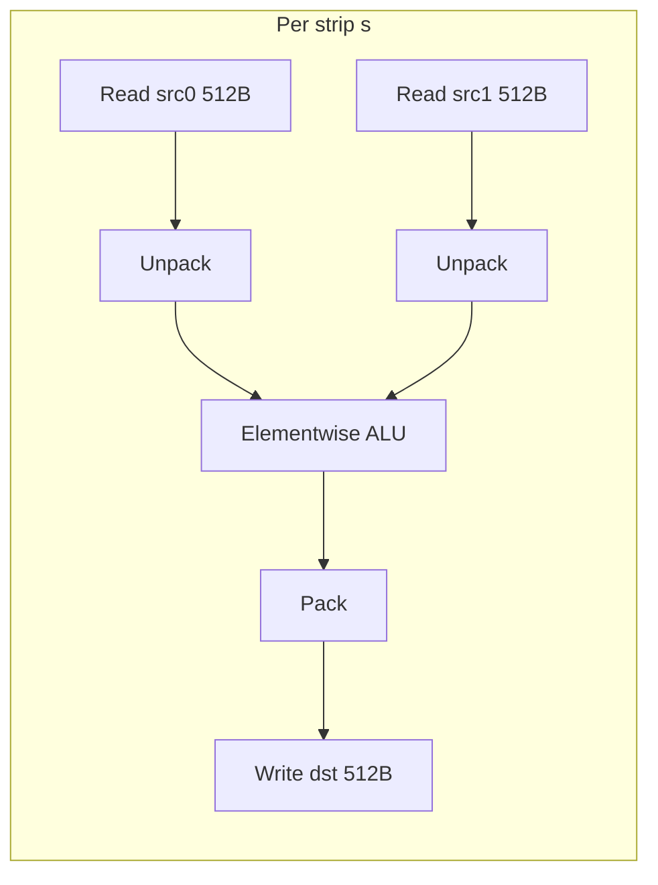
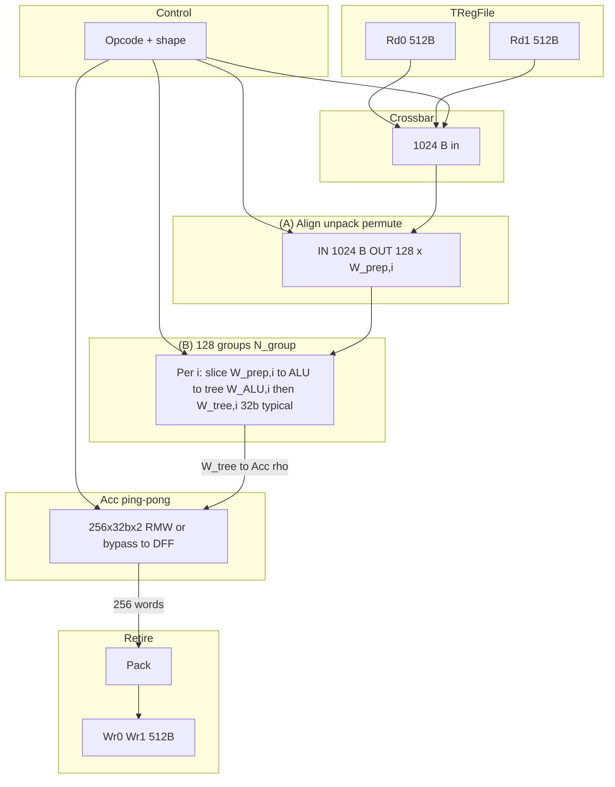
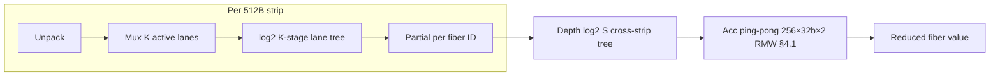

# VEC-4K: Vector Unit for 4 KB PTO Tiles (PTO ISA Subset)

## 1. Purpose and Scope

This document specifies a **vector execution unit (VEC-4K)** that implements a **software-visible subset** of the PTO Tile Lib ISA ([`PTOISA/README.md`](PTOISA/README.md)): elementwise tile–tile ops, tile–scalar ops, axis reduce/expand, and selected **complex** instructions (e.g. **TMRGSORT**, **TSORT32**, **TGATHER**, **TCI**). The unit is paired with a **tile register file (TRegFile)** holding **4 KB** tiles.

**Non-goals (this document):** matrix multiply (**TMATMUL** / **TGEMV** family), global-memory **TLOAD/TSTORE** (treated as separate DMA-like paths), and **comm** collective ISA—only the on-tile vector datapath is analyzed here.

---

## 2. Tile and Format Model

### 2.1 Storage Invariant

Each logical tile occupies exactly **4096 bytes** in the TRegFile. The logical shape is **R × C** with:

- **R** and **C** are powers of two (implementation may also require R·C to match the element count implied by the format).
- **Row-major** layout: address increases along columns within a row, then along rows.

Let **E** be the **storage bytes per logical element** in the chosen encoding:

| Logical format | Typical storage `E` (bytes / element) | Elements per 4 KB tile (N = 4096 / E) |
|----------------|----------------------------------------|----------------------------------------|
| FP32           | 4                                      | 1024                                   |
| FP16 / BF16    | 2                                      | 2048                                   |
| FP8 (E4M3/E5M2)| 1                                      | 4096                                   |
| MXFP4 / HiFP4  | ½ (packed nibble pair in byte)       | 8192                                   |

For **sub-byte** types, hardware views memory as **byte lanes**; unpack/pack stages map nibbles to wider internal operands (e.g. FP16/FP32) for ALU operations, then pack back on write.

**Valid shape examples** (illustrative):

- FP32: 32×32, 16×64, 64×16, … (R·C = 1024).
- FP16: 64×32, 32×64, 128×16, … (R·C = 2048).
- FP8: 64×64, 128×32, … (R·C = 4096).
- FP4: 128×64, 256×32, … (R·C = 8192).

### 2.2 Metadata

Each issued vector op carries **format**, **R**, **C**, and **opcode**. Microcode (or a small FSM per op) derives:

- `strip_count = 4096 / 512 = 8` **physical strips** per tile (fixed by §3).
- `elem_per_strip = 512 / E` (must be integer; hardware asserts this from format).

---

## 3. TRegFile Interface and Striping

### 3.1 Ports (Design Assumption)

| Direction | Width | Count | Aggregate |
|-----------|-------|-------|-----------|
| Read      | 512 B | 2     | **1024 B/cycle** |
| Write     | 512 B | 2     | **1024 B/cycle** |

Ports may target **independent tile bases** (e.g. `src0` and `src1`) or **the same tile** at different offsets (double-pump one operand into two buffers).

When VEC is attached to [`tregfile4k.md`](tregfile4k.md), a concrete dual-read binding is **Rd0 → R0** (**Port A**, phase **0**) and **Rd1 → R4** (**Port B**, phase **4**) so **same `tile_idx`** yields strip pair **`(G,e)`** and **`(G+4,e)`** at epoch phase **e** (**§4.4**).

**Read semantics:** TRegFile read ports present **only** full **512 B** bank-group strips per [`tregfile4k.md`](tregfile4k.md) — **no gather** (no sub-strip element indexing inside the RF). **`TCOL*`** therefore **replays** the same `reg_idx` over **multiple cycles** / **epochs** as needed; **column extraction** is done in **VEC** from **strip buffers A/B** after each read (**§5.3.2**, **§4.4 Example H**).

### 3.2 Physical Strip

A **strip** is a contiguous **512-byte** chunk at offset `s·512` for `s ∈ {0,…,7}` within the 4 KB tile. This matches one port transaction per strip.

**Minimum streaming latency (full tile), ignoring bank conflicts:**

- **Unary** (both read ports read **the same logical tile** at consecutive strip offsets): **2 strips/cycle** × **512 B** = **1024 B/cycle** → **4096 / 1024 = 4 cycles** to read one full tile.
- **Binary elementwise** (typical: **Rd0 → src0** strip `s`, **Rd1 → src1** strip `s`): **1 strip per operand per cycle** → **8 strips/operand** → **8 cycles** to ingest **both** full tiles. Software/hardware can **reuse** a buffered operand (e.g. **op reuse buffer**) to hide half of the reads on back-to-back dependent ops.

The micro-architecture below assumes **8 strip indices** per 4 KB tile and schedules **cross-strip** work where reductions, expands, or gathers require it.

### 3.3 On-Chip Buffers

- **A strip buffer** and **B strip buffer** (512 B each, **Rd0/Rd1**), optionally **double-buffered** to overlap TRegFile read with compute; **§4.1** **crossbar** ingests **1024 B/cycle** from the two ports.
- **Acc** — **256 × 32 b × 2** ping-pong (**`N_run = 512`**, **§4.1**, **§9.3.2**); optional **strip / staging** for multi-pass sorts; **§4.3** schedules **Rd0/Rd1** vs **`fiber_id`** / **Acc** updates.
- **Scalar broadcast register** (tile–scalar immediates or a single-element tile).

---

## 4. Vector Datapath Overview

### 4.1 Block Diagram (dataflow level)

**Reference micro-architecture** (counts for **scheduling** / **§5.3.2** **`N_tree`**):

```text
  ┌────────────────────────────────────────────────────────────────────┐
  │                     TRegFile (4 KB tiles)                            │
  │              Rd0 (512 B)              Rd1 (512 B)                  │
  └──────────────────┬──────────────────────────┬──────────────────────┘
                     │                          │
                     └──────────┬───────────────┘
                                │ 1024 B aggregate / cycle (2×512 B)
                                ▼
  ┌────────────────────────────────────────────────────────────────────┐
  │  Instruction opcode + shape (format, R, C, …)  ──►  CONTROL         │
  └────────────────────────────────────────────────────────────────────┘
                                │
                                ▼
              ┌─────────────────────────────────────┐
              │  CROSSBAR                           │
              │  1024 B in → distribute to compute  │
              └─────────────────┬───────────────────┘
                                │
              ┌─────────────────▼───────────────────────────────────────────┐
              │  (A) ALIGN / UNPACK / PERMUTE  (control-selected)          │
              │  IN:  1024 B / cycle from crossbar                          │
              │  OUT: 128 slices  (slice i width = W_prep,i bits)           │
              └─────────────────┬───────────────────────────────────────────┘
                                │ 128 parallel slice buses
                                ▼
              ┌─────────────────▼───────────────────────────────────────────┐
              │  (B) N_group = 128  INDEPENDENT COMPUTE GROUPS  i = 0…127   │
              │  ┌─────────────────────────────────────────────────────┐   │
              │  │  Group i (representative):                          │   │
              │  │    IN:   W_prep,i  (from A)                         │   │
              │  │    ┌──────────────────┐      ┌────────────────────┐  │   │
              │  │    │ Elementwise ALU  │ ───► │ Reduction tree     │  │   │
              │  │    │ OUT:  W_ALU,i    │      │ OUT:  W_tree,i     │  │   │
              │  │    └──────────────────┘      └─────────┬──────────┘  │   │
              │  │    Constraint: W_ALU,i ≥ W_tree,i  (allowed; tree   │   │
              │  │    narrows / retires partials; ALU may be wide SIMD) │   │
              │  │    Elementwise bypass: ALU OUT can skip deep tree    │   │
              │  │    (W_tree,i = W_ALU,i, or tree depth 0) when opcode │   │
              │  │    does not need cross-lane combine on that group.   │   │
              │  └─────────────────────────────────────────────────────┘   │
              │  Typical: W_tree,i = 32 b (FP32-shaped partial → Acc)        │
              └─────────────────┬───────────────────────────────────────────┘
                                │ 128 × W_tree,i (subset to Acc per beat)
                                ▼
              ┌─────────────────────────────────────┐
              │  ACCUMULATOR (DFF, ping-pong)       │
              │  256 × 32 b × 2 halves  ≈ 2048 B    │
              │  per slot: DFF + optional combine    │
              │    • RMW: adder (new ⊕ feedback DFF)  │
              │    • BYPASS: new → DFF (no combine) │
              │  N_run = 512 logical slots (§9.3.2) │
              └─────────────────┬───────────────────┘
                                │ mux: one 256-word half
                                ▼
              ┌─────────────────────────────────────┐
              │  Pack (wide → FP8/FP4 / narrow dst)   │
              └─────────────────┬───────────────────┘
                                │
                    ┌───────────▼───────────┐
                    │ Wr0 (512 B)  Wr1 (512 B) │
                    │  = 1024 B retire / phase   │
                    └───────────────────────────┘
```

**Flow:** **Rd0+Rd1** → **crossbar** (**1024 B/cycle**). **Control** drives **crossbar** routing, **(A)** unpack/permute **masks**, **(B)** per-group **ALU** opcode and **tree** depth (or **bypass**), and **Acc** addressing. **(A)** outputs **128** parallel **slices** of width **`W_prep,i`** (depends on **format** / **opcode** / **implementation**). **(B)** is **`N_group = 128`** identical **structures**: each slice feeds an **elementwise ALU** whose output has width **`W_ALU,i`**, then a **reduction tree** that may **narrow** to **`W_tree,i`**. **Allow `W_ALU,i ≥ W_tree,i`** (wide **SIMD** **ALU** **before** a **smaller** **tree** **footprint**). **Typical** partial to **Acc:** **`W_tree,i = 32` b** (FP32-shaped). **Pure elementwise** may use **tree depth 0** or **bypass** so **`W_tree,i = W_ALU,i`** for the path toward **Pack**. **Accumulator:** besides **RMW** (**partial ⊕** **stored** via **adder** **+** **DFF** **feedback**), **control** may **bypass** the **combine** **adder** and **write** **tree/ALU** **data** **straight** **into** the **Acc** **DFF** (**load** / **overwrite** / **non-accumulating** **retire**). **Acc** ping-pong, **Wr** half-select, **`fiber_id` / `ρ` / Acc waves:** **§5.3.2**, **§9.3.2**; **§4.3** calendars.

### 4.2 “Lanes” vs “Strips”

- **SIMD lane**: one parallel datapath processing **one logical element** after unpack (width depends on op; internal **FP32** is a reasonable unified width for expensive ops).
- **Strip**: 512 B of **spatially contiguous** storage; SIMD width = `elem_per_strip`.
- **Cross-lane** (within strip): reductions along a dimension that fits in one strip (partial row/col).
- **Cross-strip**: **control-programmed** **crossbar** + **trees** (**§4.1**) combine strip `s` and `s′` contributions, or **multi-cycle accumulation** into **Acc** ping-pong (**§9.3.2**) / **staging**.

### 4.3 Fiber ID and strip read calendar

**`fiber_id`** is the **logical index along the axis** that **reduce** and **expand/broadcast** class ops treat as a **fiber**—one **output slot** per fiber after a reduce, or one **scalar source** per fiber when expanding along that axis:

| Opcode family | `fiber_id` | Range |
|---------------|------------|--------|
| **`TROW*`** (row reduce) | row index **`r`** | `0 … R−1` |
| **`TCOL*`** (column reduce) | column index **`c`** | `0 … C−1` |
| **`TROWEXPAND*`** | **`r`** (splat target row) | `0 … R−1` |
| **`TCOLEXPAND*`** | **`c`** (splat target column) | `0 … C−1` |

**Elementwise** tile–tile ops do **not** use a single global **`fiber_id`**; they are scheduled **strip-by-strip** only. **Gather/sort/merge** use their own index streams; where they write **per-row/col** state, that state can still be keyed like **`fiber_id`** for buffer allocation.

**From strip bytes to `(r, c)` and `fiber_id`:** For strip index **`s ∈ {0,…,7}`** and lane/byte offset inside the **512 B** chunk, **row-major** layout fixes a linear element order; decode **`(r, c)`** from **`(R, C, E)`**. Then **`fiber_id = r`** or **`c`** according to the opcode’s **axis**. **Control** drives the **crossbar** (**§4.1**) so **unpack**, **permutation**, and **tree/ALU** inputs see the correct segment for each **`fiber_id`** touched in that strip.

**Strip read calendar:** A **calendar** is the **cycle-by-cycle** schedule that binds **what arrives on Rd0/Rd1** to **what the datapath does**—in particular, **which operands feed each lane** and **which `fiber_id`(s)** touch **Acc** or **per-fiber `v` buffers** that cycle.

- **Port row (per cycle `t`):** specifies **`s(t)`** (which **512 B** chunk), **which logical tile** each port reads (**`src0`**, **`src1`**, narrow **`v`** tile, scalar tile, **ping-pong scratch** for merges/sorts, or **idle**), and optional **second-pass** phases. **`TCOL*`** does **not** use a **transpose scratchpad** — only **normal** `reg_idx` tiles in **row-major** strip order (**§5.3.2**). TRegFile ports **cannot gather** (**§3.1**); **`TCOL*`** may **repeat** the **same** `reg_idx` over **multiple TRegFile epochs** when **`#W = max(⌈C/N_acc⌉, ⌈C/(N_tree·f)⌉, ⌈C/N_run⌉) > 1`** (**§5.3.2**, **§4.4 Example H**; **`#W`** **reduces** to **two** **terms** **when** **`N_acc ≤ N_run`**).
- **Operand sources (`TROW*` reduce):** **Tile elements** arrive strip-serially from **read ports**; after **unpack → within-strip tree → cross-strip combine**, the reducer performs **RMW** on **Acc** at **`fiber_id = r`**. Physical slot **`ρ`** is **`fiber_id` remapped** into **`[0, N_run)`** for the current **Acc wave** (§9.3.2: **`bank = ρ mod 8`**, **`word = ρ >> 3`**, **0…63**). One strip can touch **many** distinct **`fiber_id`**s when **`row_B < 512`** or **`col_B < 512`** (many thin fibers per strip).
- **Operand sources (`TCOL*` reduce):** Ports still deliver **full rows** inside each **512 B** strip; **VEC** **selects** **`(r,c)`** for the scheduled **column band** from **strip buffers** (**no RF gather**). **Acc[`c`]** **+=** partial sums across strip-beats and, if needed, across **re-scans** of the tile.
- **Operand sources (expand):** **`v[fiber_id]`** is supplied from a **narrow per-fiber vector** streamed on a read port, from **Acc / staging** after an in-place reduce, or from a **small buffer** filled in a **prefetch** phase; **`src`** elements still arrive **strip-major** like §5.1. The calendar interleaves **`v`** strip reads with **`src`** strips so each cycle’s SIMD sees a consistent **`(fiber_id, lane)`** map.

**Templates:** Opcode decode picks a **calendar template** from **`(format, R, C, opcode)`**. The §9 metrics **`rS`, `rW`, `rK`, …** / **`cS`, `cW`, …** fix how many **within-strip** rounds and how **8-strip** walks align with **cross-strip** merge. The **47** distinct scheduling recipes in **§9.5.1** are **calendar families** over the same datapath, not separate RTL blocks. **Epoch-aligned worked tables** vs [`tregfile4k.md`](tregfile4k.md): **§4.4**.

**Illustrative calendar row** (one cycle of a row-reduce pass; details vary by shape):

| Field | Content |
|-------|---------|
| **`t`** | Cycle index in the micro-sequence |
| **Rd0 / Rd1** | e.g. **`src` strip `s`**, second operand or **`idle`** |
| **`s`** | Current **strip index** `0…7` (or remapped pass) |
| **Lane → `(r,c)`** | From **§2.1** row-major map |
| **`fiber_id`s updated** | Subset of **`r`** appearing in this strip’s segment |
| **Acc** | **RMW** at decoded **bank/word** for each retiring partial |

### 4.4 Epoch-aligned fiber calendars vs `tregfile4k.md` (four worked examples)

Full **(format, shape)** enumeration would need **76** row-axis templates alone (§9); this subsection fixes **VEC ↔ TRegFile-4K** timing and shows **eight** representative **`fiber_id`** calendars (**Examples A–H**; **E–H** emphasize **FP8** and **MXFP4**). See [`tregfile4k.md`](tregfile4k.md): global **`e = cy[2:0]`** (phase within an **8-cycle** epoch); read port **Rp** presents bank-group **`G = (p + e) mod 8`** (**512 B** = one **strip** **Gs**).

**Port binding for the tables:**

| Logical name | TRegFile read port | Phase `p` | Strip delivered at phase `e` |
|--------------|-------------------|-----------|--------------------------------|
| **Port A** | **R0** | 0 | **`G_A = e`** |
| **Port B** | **R4** | 4 | **`G_B = (4 + e) mod 8`** |

**Epoch start:** **`t = 0`** is an **epoch boundary** (**e = 0**): the **`reg_idx`** for each port is **active** for the next 8 cycles (pending→active promotion, `tregfile4k.md` §4).

**Dual-port same `tile_idx` on A+B:** in cycles **`t = 0…3`** (**e = 0…3**), the pair **`(G_A, G_B)`** visits **`(0,4), (1,5), (2,6), (3,7)`** — every strip **Gs ∈ {0,…,7}** appears **exactly once** as **one** of the two 512 B beats. Cycles **`t = 4…7`** repeat the **same** strip schedule (second lap with the **same** latched tile on both ports); microcode **suppresses duplicate Acc** or reuses beats for **another operand** / **write path**. **Benefit:** **4 cycles** to see all **8** strips **once** with **two** 512 B reads/cycle vs **8 cycles** with **Port A only** (Port B **idle**).

**Row-major element index** in a strip: byte offset **`512·Gs + δ`** with **`δ`** increasing along **columns** within the row segment; **`fiber_id = r`** for **`TROW*`** labels which **row**’s **C** elements are being reduced or expanded.

**Column shorthand in tables:**

| Column | Meaning |
|--------|---------|
| **`t`**, **`e`** | Core cycle from op **epoch start**; **`e = t mod 8`**. |
| **Port A / B** | **`T@Gs`** = tile **`reg_idx` T** and physical strip **Gs** (512 B). **`—`** = port unused this cycle. |
| **Fibers (this beat)** | **`fiber_id`** values whose **row data** (reduce) or **row op** (expand) is anchored on **that port’s** strip in this cycle. |
| **First elem @ port** | Logical **element** at **byte 0** of that port’s 512 B chunk for the listed fiber (start of the row segment in that strip). |
| **`#elem`** | **Logical elements along the row** (along **C**) taken from **that port** this cycle toward **`TROW*`** / expand **`src`**. |
| **Reduce / expand** | **`TROWSUM`:** cross-lane tree over **`#elem`** → **one** partial per **`fiber_id = r`** → **Acc RMW**. **`TCOL*`** (**§5.3.2**): **`fiber_id = c`**; **strip replay** + **VEC column mux** + **`Acc[c]`** **RMW**; **`P_beat = min(N_tree, N_acc)`**; **`#W = max(⌈C/N_acc⌉, ⌈C/(N_tree·f)⌉, ⌈C/N_run⌉)`** (**`f`**, **`N_run`**, **§5.3.2**; **`#W`** ≡ **`#waves`** **when** **`⌈C/N_run⌉ ≤ ⌈C/N_acc⌉`**) — **§4.4 Example H**. **`TROWEXPANDADD`:** for each **`fiber_id`**, combine **`#elem`** **`src`** lanes with **`v[fiber_id]`** (from **`v`** tile or latch). |

*End-to-end latency* may add **tree pipeline stages** after the last ingest cycle; tables list **operand arrival** and **per-fiber arithmetic scope** per cycle.

---

#### Example A — `TROWSUM`, **FP32**, **8×128** (`C = 128`, **one row = one strip**)

**Geometry:** **`row_B = 512 B`**, strip **Gs** holds **exactly row `r = Gs`**. **Dual-port** same **`src`** tile on **A+B** gives **two rows/cycle** for **`t = 0…3`**; **`t = 4…7`** are duplicate strip delivery (masked).

| `t` | `e` | Port A | Port B | Fibers (A) | First elem @ A | `#elem` | Fibers (B) | First elem @ B | `#elem` | Reduce note |
|----:|----:|--------|--------|------------|----------------|--------:|------------|----------------|--------:|-------------|
| 0 | 0 | `src@G0` | `src@G4` | `r=0` | elem `(0,0)` | 128 | `r=4` | elem `(4,0)` | 128 | 2× `TROWSUM` lane-tree → **Acc** `r=0`, `r=4` |
| 1 | 1 | `src@G1` | `src@G5` | `r=1` | `(1,0)` | 128 | `r=5` | `(5,0)` | 128 | **Acc** `r=1`, `r=5` |
| 2 | 2 | `src@G2` | `src@G6` | `r=2` | `(2,0)` | 128 | `r=6` | `(6,0)` | 128 | **Acc** `r=2`, `r=6` |
| 3 | 3 | `src@G3` | `src@G7` | `r=3` | `(3,0)` | 128 | `r=7` | `(7,0)` | 128 | **Acc** `r=3`, `r=7` |

**Unique ingest complete at `t = 3`** (8 fibers, each **128** elements). **Single-port (A only):** stretch to **`t = 0…7`**, one row/cycle, **no** dual-port gain.

---

#### Example B — `TROWSUM`, **FP32**, **32×32** (`C = 32`, **4 rows / strip**)

**Geometry:** **`row_B = 128 B`**, **`512 / 128 = 4`** rows per strip. **Single Port A** is enough (dual port does **not** shorten **unique** row coverage unless compute is strip-bound and overlapped differently); **Port B idle**.

| `t` | `e` | Port A | Port B | Fibers (A) | First elem @ A (each fiber) | `#elem` each | Reduce note |
|----:|----:|--------|--------|------------|-----------------------------|----------------|-------------|
| 0 | 0 | `src@G0` | — | `0,1,2,3` | `(0,0)`, `(1,0)`, `(2,0)`, `(3,0)` | 32 | 4× lane-tree (`K=32`) → **Acc** `r=0…3` |
| 1 | 1 | `src@G1` | — | `4,5,6,7` | `(4,0)`…`(7,0)` | 32 | **Acc** `r=4…7` |
| 2 | 2 | `src@G2` | — | `8,9,10,11` | … | 32 | **Acc** |
| 3 | 3 | `src@G3` | — | `12…15` | … | 32 | **Acc** |
| 4 | 4 | `src@G4` | — | `16…19` | … | 32 | **Acc** |
| 5 | 5 | `src@G5` | — | `20…23` | … | 32 | **Acc** |
| 6 | 6 | `src@G6` | — | `24…27` | … | 32 | **Acc** |
| 7 | 7 | `src@G7` | — | `28…31` | … | 32 | **Acc** |

**32** fibers, each **`#elem = C = 32`** from **Port A** only; **8 cycles** = one epoch, **one** `reg_idx` on **R0**.

---

#### Example C — `TROWEXPANDADD`, **FP32**, **8×128** (`v[r]` + `src`)

**`v` tile:** **8** row scalars as **FP32** = **32 B** at **byte offset 0** of strip **G0** (tile **`v`**; remaining bytes **don’t-care**).

**Why prefetch `v`:** If **`v@G0`** were on **Port B** while **`src`** streams on **Port A** only, **dual-port** cannot also deliver **`src@G4`** in the **same** cycle. **High bandwidth schedule:** (1) **Pre-epoch** or **`t_pre`:** **Port B** reads **`v@G0`** once; latch **`v[0]…v[7]`** (bytes **0–3**, **4–7**, …, **28–31**). (2) **`t = 0…3`:** **Port A** and **Port B** both carry **`src`** with **same** `reg_idx` as Example **A** — **two rows/cycle**.

| `t` | `e` | Port A | Port B | Fibers (`src`) | First elem @ A | First elem @ B | `#elem` / fiber | **`v[fiber_id]`** | Expand |
|----:|----:|--------|--------|----------------|----------------|----------------|-----------------|-------------------|--------|
| 0 | 0 | `src@G0` | `src@G4` | `r=0`, `r=4` | `(0,0)` | `(4,0)` | 128 | **latched** **`v[0]`**, **`v[4]`** | **128** lanes/fiber: **`src` + v** |
| 1 | 1 | `src@G1` | `src@G5` | `r=1`, `r=5` | `(1,0)` | `(5,0)` | 128 | **latched** **`v[1]`**, **`v[5]`** | … |
| 2 | 2 | `src@G2` | `src@G6` | `r=2`, `r=6` | … | … | 128 | **latched** **`v[2]`**, **`v[6]`** | … |
| 3 | 3 | `src@G3` | `src@G7` | `r=3`, `r=7` | … | … | 128 | **latched** **`v[3]`**, **`v[7]`** | … |

**`t_pre` (one beat, e.g. previous epoch):** **Port B** = **`v@G0`**, **Port A** = **—** or next **`src`** prefetch; **first element of `v[0]`** = **byte 0** of **B**’s 512 B chunk.

---

#### Example D — `TROWSUM`, **HiFP4**, **256×32** (`C = 32`, **`E = ½`**, **32 rows / strip**)

**Geometry:** **`row_B = 16 B`** = **32** logical elements/row; **`512 / 16 = 32`** distinct **`fiber_id`** values per strip. **Dual-port** same **`src`**: **`t = 0…3`** covers **256** rows (all fibers) with **64** partial trees/cycle (32 fibers × 2 ports).

| `t` | `e` | Port A | Port B | Fiber IDs (A) | First elem @ A | `#elem` | Fiber IDs (B) | First elem @ B | `#elem` | Reduce note |
|----:|----:|--------|--------|---------------|----------------|--------:|---------------|----------------|--------:|-------------|
| 0 | 0 | `src@G0` | `src@G4` | `r=0…31` | row `r` starts at byte **`16r`** mod strip | 32 each | `r=128…159` | byte **`16(r−128)`** in **G4** strip | 32 each | **64** lane-trees → **64** **Acc** RMW (**watch bank** = `r mod 8`) |
| 1 | 1 | `src@G1` | `src@G5` | `32…63` | … | 32 | `160…191` | … | 32 | **64** **Acc** |
| 2 | 2 | `src@G2` | `src@G6` | `64…95` | … | 32 | `192…223` | … | 32 | **64** **Acc** |
| 3 | 3 | `src@G3` | `src@G7` | `96…127` | … | 32 | `224…255` | … | 32 | **64** **Acc** |

**`t = 4…7`:** duplicate **`src`** strips (suppress **Acc** idempotent re-reduce) unless **`reg_idx`** advances to a **second** tile / phase.

---

#### Example E — `TROWSUM`, **FP8** (`E = 1`), **64×64** (`C = 64`, **8 rows / strip**)

**Geometry:** **`row_B = 64 B`** = **64** **`UINT8`/FP8** elements along the row; **`512 / 64 = 8`** distinct **`fiber_id`** values per strip. **Dual-port** same **`src`**: **`t = 0…3`** ingests all **64** rows (**16** partial trees/cycle).

| `t` | `e` | Port A | Port B | Fiber IDs (A) | First elem @ A | `#elem` | Fiber IDs (B) | First elem @ B | `#elem` | Reduce note |
|----:|----:|--------|--------|---------------|----------------|--------:|---------------|----------------|--------:|-------------|
| 0 | 0 | `src@G0` | `src@G4` | `r=0…7` | row `r` at byte **`64r`** in **G0** | 64 | `r=32…39` | byte **`64(r−32)`** in **G4** *(base row **32**)* | 64 | **16** lane-trees → **Acc** (unpack **FP8→FP32** internal) |
| 1 | 1 | `src@G1` | `src@G5` | `8…15` | … | 64 | `40…47` | … | 64 | **16** **Acc** |
| 2 | 2 | `src@G2` | `src@G6` | `16…23` | … | 64 | `48…55` | … | 64 | **16** **Acc** |
| 3 | 3 | `src@G3` | `src@G7` | `24…31` | … | 64 | `56…63` | … | 64 | **16** **Acc** |

---

#### Example F — `TROWSUM`, **FP8** (`E = 1`), **16×256** (`C = 256`, **2 rows / strip**)

**Geometry:** **`row_B = 256 B`**; **`512 / 256 = 2`** rows per strip. **Dual-port** same **`src`**: **4** cycles × **4** fibers/cycle = **16** rows.

| `t` | `e` | Port A | Port B | Fibers (A) | First elem @ A | `#elem` | Fibers (B) | First elem @ B | `#elem` | Reduce note |
|----:|----:|--------|--------|------------|----------------|--------:|-----------|----------------|--------:|-------------|
| 0 | 0 | `src@G0` | `src@G4` | `r=0`, `1` | `(0,0)`, `(1,0)` | 256 each | `r=8`, `9` | strip **G4** row **8** at byte **0**, row **9** at byte **256** | 256 | **4** trees (`K=256`, **`D_lane = 8`**) |
| 1 | 1 | `src@G1` | `src@G5` | `2`, `3` | … | 256 | `10`, `11` | … | 256 | **4** **Acc** |
| 2 | 2 | `src@G2` | `src@G6` | `4`, `5` | … | 256 | `12`, `13` | … | 256 | **4** **Acc** |
| 3 | 3 | `src@G3` | `src@G7` | `6`, `7` | … | 256 | `14`, `15` | … | 256 | **4** **Acc** |

*(Row **8** in **G4:** byte offset **`512·4 = 2048`** = **`8 × 256`**.)*

---

#### Example G — `TROWSUM`, **MXFP4** (`E = ½`, packed nibble), **512×16** (`C = 16`, **64 rows / strip**)

**Geometry:** **`row_B = 8 B`** = **16** logical FP4 elements/row; **`512 / 8 = 64`** **`fiber_id`**s per strip. **Dual-port** same **`src`**: **`t = 0…3`** covers **512** rows (**128** lane-trees/cycle). **Unpack** maps **nibble lanes** to **wide** compare/add operands before **Acc**.

| `t` | `e` | Port A | Port B | Fiber IDs (A) | First elem @ A | `#elem` | Fiber IDs (B) | First elem @ B | `#elem` | Reduce note |
|----:|----:|--------|--------|---------------|----------------|--------:|---------------|----------------|--------:|-------------|
| 0 | 0 | `src@G0` | `src@G4` | `r=0…63` | row `r` at byte **`8r`** in **G0** | 16 | `r=256…319` | byte **`8(r−256)`** in **G4** | 16 | **128** trees → **128** **Acc** RMW |
| 1 | 1 | `src@G1` | `src@G5` | `64…127` | … | 16 | `320…383` | … | 16 | **128** **Acc** |
| 2 | 2 | `src@G2` | `src@G6` | `128…191` | … | 16 | `384…447` | … | 16 | **128** **Acc** |
| 3 | 3 | `src@G3` | `src@G7` | `192…255` | … | 16 | `448…511` | … | 16 | **128** **Acc** |

---

#### Example H — `TCOLSUM`, **MXFP4** (`E = ½`), **32×256** (`R = 32`, **`C = 256`**, **native row-major**)

**TRegFile:** Read ports emit **only** full **512 B** strips (**[`tregfile4k.md`](tregfile4k.md)**); **there is no gather** inside the tile RF. **`TCOLSUM`** cannot request “column **`c`** only” from the file — it must **accept whole strips** on **Port A / Port B**, then **select** the needed **`(r,c)`** in **VEC** (strip buffers → unpack → **column mux** / shifter network).

**Policy:** **No transpose scratchpad** (**§5.3.2**). Operand remains **one** `reg_idx`, **§2.1** row-major. **Acc[`c`]**: **read–modify–write** associative **add** so partials from each strip-beat **accumulate** until all **R = 32** row contributions for column **`c`** are seen.

**Hardware parallelism (§5.3.2):** Let **`N_tree`** = parallel **adder / reduce trees** per beat; **`N_acc`** = parallel **Acc** **RMW** slots per cycle (**`N_acc ≤ N_run`**, **§9.3.2**); **`f`** = **effective `Acc[c]` commits per tree per full tile scan** (one **dual-ingest** pass over **all** strips — includes **sub-cycles** / **pipeline**). **Same-cycle** combine+retire is capped by **`P_beat = min(N_tree, N_acc)`**.

**Wave count (both limits):**

**`#W = max(⌈C / N_acc⌉, ⌈C / (N_tree · f)⌉, ⌈C / N_run⌉)`** (**`#W`** **tile-epoch** **count**; **synonym** **`#waves`** **below** **when** **`N_acc ≤ N_run`** **⇒** **`⌈C/N_run⌉ ≤ ⌈C/N_acc⌉`**)

- **`#waves_acc = ⌈C / N_acc⌉`**: **Acc-band** partitioning (**≤ `N_acc`** columns **finished** per **wave** if **trees** keep up).  
- **`#waves_tree = ⌈C / (N_tree · f)⌉`**: when **`N_tree ≪ N_acc`**, **tree throughput** may require **more** **full scans** than **`#waves_acc`** predicts.  
- **`#waves_Nrun = ⌈C / N_run⌉`**: **DFF** **capacity** (**§5.3.2**); **redundant** **vs** **`#waves_acc`** **when** **`N_acc ≤ N_run`**.

When **`N_acc > N_tree`**, **trees** are **time-multiplexed** over **sub-cycles**; **`f`** must be **measured** from **RTL**/**micro-arch** (Example: **`S = 4`** strip-pair beats × **`f_micro`** commits per beat per tree).

**Illustrative numbers:** **`C = 256`**, **`N_acc = 64`**, **`N_run = 512`** → **`#waves_acc = 4`**, **`⌈C/N_run⌉ = 1`**. With **`N_tree = 8`**, **`f = 8`** (e.g. **8** **`Acc[c]`** commits per tree over one **4-beat** scan × **2** **micro** rounds): **`N_tree · f = 64`**, **`#waves_tree = 4`**, **`#W = max(4, 4, 1) = 4`**. With **`N_tree = 4`**, **`f = 8`**: **`N_tree · f = 32`**, **`#waves_tree = 8`**, **`#W = max(4, 8, 1) = 8`** — **tree**-limited; **strip calendar** is unchanged, but **microcode** runs **more** **tile** **epochs** and may **shrink** the **column band** per wave below **`N_acc`**.

**Acc-limited schedule (`#W = ⌈C / N_acc⌉`):** **`c_base = N_acc · k`** as in the tables below. **`N_tree = 32`**, **`N_acc = 64`** may still need **two** **tree** **phases** per **`t`** — **micro-cycles** expand **`f`**; re-check **`#waves_tree`**.

**Geometry:** **`row_B = 128 B`** (**256** FP4 elements/row); **4** rows per **512 B** strip. **Dual** read (**R0+R4**, **§3.1**): **`t = 0…3`** (**`e = 0…3`**) delivers **unique** strip pairs **`(0,4)…(3,7)`** and visits **all 32** rows **once per full scan**. Cycles **`t = 4…7`** of the **same** TRegFile **epoch** repeat the **same** strips (second lap with identical `reg_idx`); **disable Acc updates** on **`t = 4…7`** unless **overlapped** with another **column band** (implementation choice).

**If `N_acc ≥ C`:** **one** wave (**one** scan, **`t = 0…3`**) suffices for all columns.

**Per-strip-beat (one wave):** From **A**/**B** buffers, **column mux** pulls **`(r,c)`** for **`c`** in the active band only; **8** row samples per **`c`** per **`t`** (4 rows × 2 ports) → **`Acc[c] +=`** partial (after **`K = 8`** interim reduce via **`N_tree`** lanes). After **`t = 3`** for that wave, each **`c`** in the band has **32** row terms accumulated → **done** for **`TCOLSUM`** (modulo tree **pipeline**).

**Strip calendar (identical each wave; `c_base = N_acc · k`):**

| `t` | `e` | Port A | Port B | Rows in A / B | **`fiber_id` band** | Per-**`c`** row samples this `t` | **Acc** |
|----:|----:|--------|--------|---------------|---------------------|----------------------------------|---------|
| 0 | 0 | `src@G0` | `src@G4` | **0–3** / **16–19** | **`c ∈ [c_base, c_base + N_acc − 1]`** | **8** | **`Acc[c] +=`** partial from **8** **`(r,c)`** (mux from **A/B**) |
| 1 | 1 | `src@G1` | `src@G5` | **4–7** / **20–23** | same band | **8** | **+=** … |
| 2 | 2 | `src@G2` | `src@G6` | **8–11** / **24–27** | same band | **8** | **+=** … |
| 3 | 3 | `src@G3` | `src@G7` | **12–15** / **28–31** | same band | **8** | **32** terms integrated per **`c`** in band |

**`(r,c)` byte** in a strip with base row **`r₀`**: **`(r − r₀)·row_B + ⌊c·E⌋`** plus **nibble** select (**`E = ½`**). **Multi-epoch summary** (**Acc-limited** **`#W = 4`**, i.e. **`#waves_tree ≤ #waves_acc`**; **`N_acc = 64`**, **`N_run = 512`**):

| Wave `k` | Tile read policy | Active columns | Strip beats used |
|----------|------------------|----------------|------------------|
| 0 | Same `reg_idx`, epoch **E0** | **`c = 0…63`** | **`t = 0…3`** as above |
| 1 | **Re-read** same tile, epoch **E1** | **`c = 64…127`** | repeat calendar |
| 2 | epoch **E2** | **`c = 128…191`** | repeat |
| 3 | epoch **E3** | **`c = 192…255`** | repeat |

If **`#waves_tree > #waves_acc`**, add **waves** **`k = 4 … #W − 1`** with **overlapping** or **narrower** **column** **bands** — **implementation**-specific.

**Cycle lower bound (illustrative):** **`#W × 4`** strip-pair cycles (**`#W`** from **§5.3.2** **`max(⌈C/N_acc⌉, ⌈C/(N_tree·f)⌉, ⌈C/N_run⌉)`**), **plus** **epoch** turnarounds — **implementation-dependent**. **Single-port A only** doubles strip cycles per scan (**`t = 0…7`** unique).

**§9 `c*`** metrics still bound **tree / strip** complexity; they **exclude** **transpose scratch**, **`#W`** **tile replays**, **`f`**, **`N_run`**, **TRegFile** **non-gather** replay — add explicitly in schedules (**§5.3.2**).

---

## 5. Instruction Categories and Cycle Sketches

The following uses **R**/**C** notation, **S = 8** strips, and **read_pair** = one cycle with both 512 B read ports used. **Write_pair** = both write ports used (same or different tiles depending on retire policy).

### 5.1 Elementwise (Tile–Tile)

**Representative:** `TADD`, `TMUL`, `TAND`, `TCMP`, `TCVT` (unary ops such as `TABS`/`TRELU` omit one read port per strip).

**Dataflow (non-pipelined sketch):**

1. For each strip index `s = 0…7`: `read_pair` loads `src0[s]` and `src1[s]` → unpack → SIMD op → pack into `dst[s]` staging.
2. Retire `dst[s]` with `write_pair` (same cycle as next strip’s read if the pipeline supports **read–compute–write** overlap).

**Latency:** **8 cycles** minimum to **read** both operand tiles strip-by-strip; with **pipelining** (overlap read `s+1` with write `s−1`), end-to-end often **~10–12 cycles** for a full `dst` tile (implementation-dependent buffering).

**Cross-lane:** **none** for pure elementwise; SIMD lanes are independent within the strip.

**Special:** `TCVT` may widen/narrow; internal path uses **wider SIMD** or **two-pass** if pack/unpack asymmetry exceeds one cycle.



---

### 5.2 Tile–Scalar / Tile–Immediate

**Representative:** `TADDS`, `TMULS`, `TCMPS`, `TEXPANDS`, `TADDSC`.

**Scalar path:**

- Immediate or **single-element tile** loaded once into **scalar broadcast reg** (optional **1-cycle** read of a dedicated scalar slot).
- Each strip: SIMD op **lane_i = f(tile[s]_i, scalar)**.

**Cycles:** same order of magnitude as §5.1; **one fewer** long-latency operand read if scalar is in a control register.

**Cross-lane:** none (unless scalar differs per row/col via side table—then becomes expand-like).

---

### 5.3 Axis Reduce

**Row-reduce examples:** `TROWSUM`, `TROWMAX`, `TROWARGMAX` (reduce across **columns** within each row).  
**Column-reduce examples:** `TCOLSUM`, `TCOLMAX`, `TCOLARGMAX`.

**Key geometric fact:** a **512 B strip** spans a **contiguous run** of row-major storage; for **large C**, one row may span **multiple strips**; for **small C**, one strip may hold **multiple partial rows**. The control FSM computes `(row, col)` range per strip from `(R, C, E)`.

**Scheduling:** Reduce passes are driven by a **strip read calendar** keyed by **`fiber_id = r`** or **`c`** (**§4.3**): each cycle’s **Rd0/Rd1** transactions determine **operand sources**; partials retire to **Acc** on the matching **`fiber_id`**. **`TCOL*`** obeys **§5.3.2** (**no transpose scratchpad**; TRegFile **no gather** — **strip replay** + **VEC column select** + **Acc RMW**).

#### 5.3.1 Row-wise reduce (e.g. `TROWSUM`)

For each **row r**, compute `acc[r] = reduce_{c} M[r,c]`.

**Phase A – partial reduce within strip:**

- For strips that contain **multiple columns of the same row segment**, use **horizontal SIMD tree** within the strip (cross-lane inside SIMD).

**Phase B – cross-strip combine for rows spanning strips:**

- Strips contributing to the same row feed a **segmented reduction network** or write **partial sums** to **Acc** (logical index `r`, physical slot **`ρ`** when **`N_run < R`**, **§9.3.2**), then **second pass** reads back when row complete. **Logical** depth (**rAccB** / **rStgUB**) is in **§9.3.1**; **legal shapes** in **§9.7**; **running** silicon = **`N_run`** DFF entries.

**Cycle sketch (conceptual):**

| Phase | Action |
|-------|--------|
| 1 | For each strip `s` in 0…7: read tile strip, compute **strip-partial** per affected row segment → **Acc** RMW (atomic add/max/…) |
| 2 | If all columns of row seen, **finalize** row result to narrow format |
| 3 | For `TROWEXPAND`-style output of scalar-per-row, stream writes; for true reduce producing **R×1** or packed vector tile, **write compact tile** over multiple cycles |

**`TROWARGMAX` / `TROWARGMIN`:** each strip produces **(value, col_index)** pairs; cross-strip compare selects winner; **cross-lane compare tree** + **index mux**.

```text
  Strip0 partial ──┐
  Strip1 partial ──┼──▶ Per-row combine (max/sum) ──▶ Row result tile
  ...              │
  Strip7 partial ──┘
        ▲
        └── updates keyed by row id (cross-strip)
```

#### 5.3.2 Column-wise reduce (e.g. `TCOLSUM`, `TCOLMAX`)

**Architectural rule (VEC-4K):** **`TCOL*`** **must** be implemented on the **operand tile’s native row-major** layout as seen through **normal TRegFile** `reg_idx` / **512 B strip** reads. **No transpose scratchpad tile** — software and microcode **shall not** rely on materializing a **C×R** row-major **copy** of the operand in a separate tile **for the sole purpose of column reduction**.

**Parallelism — `N_tree` vs `N_acc` (hardware):**

| Symbol | Meaning |
|--------|---------|
| **`N_tree`** | Parallel **adder / reduce** (or **elementwise**) **paths** after the **crossbar** (**§4.1**). **Reference implementation:** **`N_tree = 128`**. Scheduling **examples** below may use **smaller** **illustrative** values. |
| **`N_acc`** | **Distinct** **`Acc[·]`** **RMW** (or **commit**) slots **in the same cycle** — limited by **`N_tree`**, **adder feedback** **ports**, and **`N_run`** (**§9.3.2**): **`N_acc ≤ N_run`** (**512**); **one ping-pong half** holds **256** slots (**1024 B**). |

**Coupling:** On a **single** beat, **at most `min(N_tree, N_acc)`** columns can **both** **combine** fresh partials **and** **retire** to **Acc** in the **same** cycle if **tree output** must **pair** **1:1** with an **accumulator write**.

**When `N_acc > N_tree`:** **Trees** are the **scarce** resource; microcode may **time-multiplex** **`N_tree`** trees across **sub-cycles** while **keeping `N_acc`** **accumulators** **live** (pipeline registers + **Acc**). Once **pipelined**, the **schedule** can still **advance up to `N_acc` column accumulations per cycle** by **feeding** accumulators from **staggered** tree outputs.

**Accumulator-centric wave count** (column **bands** sized by **Acc** retire slots):

**`#waves_acc = ⌈C / N_acc⌉`**

(i.e. **`num_col / num_acc`**, rounded up): each **wave** is one **complete** **row-major** scan of the operand tile, updating a **disjoint band** of **at most `N_acc`** columns’ **`Acc[c]`** toward the final **R**-way reduce.

**Tree-limited wave count (`N_tree ≪ N_acc`):** Define **`f`** as the **effective number of distinct `Acc[c]` commits** each **single** **adder tree** can **sustain per full operand tile scan** (one **dual-port** ingest of **all** strips, e.g. **`t = 0…3`** in Example H), **after** **pipelining** and **sub-cycle** multiplex (**`f`** counts **tree→Acc** **throughput** over the **whole** scan — product of **commits per strip-beat** × **number of beats**, **bypass**, and **stage depth**). If **trees** cannot **produce** partials fast enough to **match** **`#waves_acc`**, **more** **tile replays** are needed:

**`#waves_tree = ⌈C / (N_tree · f)⌉`**

**DFF capacity wave count (`N_run`):**

**`#waves_Nrun = ⌈C / N_run⌉`**

**Combined (conservative, full-tile replays for `TCOL*`):**

**`#W = max(⌈C / N_acc⌉, ⌈C / (N_tree · f)⌉, ⌈C / N_run⌉)`**

Treat **`#W`** as the **tile-scan / epoch** **count** **lower bound** for **correct** **`TCOL*`** (**`#waves`** is an **alias** when **unambiguous**). **`K_outer`** (**§8**, **write staging**) counts **outer** **fiber-offset** **campaigns**; it **need not** equal **`#W`** — **avoid** **double-counting** **tile** **replays** **unless** the **micro-op** **nest** (**outer** × **inner** strip loop) is **specified**.

**Redundancy:** **`N_acc ≤ N_run`** (**§9.3.2**) ⇒ **`C / N_acc ≥ C / N_run`** ⇒ **`⌈C / N_acc⌉ ≥ ⌈C / N_run⌉`** for **`C > 0`**, so **`#waves_Nrun`** **never exceeds** **`#waves_acc`** **in that regime** — the **third** **`max`** **term** is **for** **generality** (alternate **schedules**, **tooling**, or **future** **caps**) and **matches** **`#waves_acc`** **when** **`N_acc = N_run`**.

When **`N_tree · f ≥ N_acc`**, **`#waves_tree ≤ #waves_acc`** and **`#W = max(⌈C / N_acc⌉, ⌈C / N_run⌉) = ⌈C / N_acc⌉`** (still **Acc-band** **long pole** if **`N_acc ≤ N_run`**).

**Fiber-capacity rounds (`N_run`):** if **more output fibers** are **live** than **`N_run`** DFF slots allow in one **in-core** pass, or an **extreme `(R,C)`** forces **narrow bands** per **outer** iteration, **opcode decode** expands **one** architectural **`TROW*` / `TCOL*`** into **`K_outer` hardware loops** (nested **outside** the **strip** walk). Each **outer** iteration carries a **fiber base / offset** (`c_base`, `r_base`, …) so **only** **`≤ N_run`** **logical** fibers map to **physical `ρ`** in **Acc** at a time; the **inner** loop is still the **usual** **row-major** strip calendar (**§4.3**). **Correctness** is preserved by **trading latency for capacity**.

**Write-side staging across outer loops:** **Wr0 / Wr1** (and **Pack** ahead of them) may hold **wide staging registers** — **per-strip** or **per-output-slice** — where **partial result tiles** or **completed fiber bands** from **earlier** outer iterations **accumulate** or **merge** until the **full** **`R`×`C`** (or **per-fiber vector**) output is **complete**. For **associative** reduces (**sum** / **max** / **min**), **merge** order must match **ISA numerics** (e.g. **sum** associativity vs **rounding**); **arg** ops need **value∥index** staging consistent across rounds (**§9.3.2**). This is **invisible** at **single-instruction retire** if the **VEC** does **not** commit **`dst`** until the **last** outer loop.

**When `N_acc ≤ N_tree`:** **Acc** is the **bottleneck** for **parallel column retires**; **`#waves_acc`** **still** applies; **`min(N_tree, N_acc) = N_acc`** caps **simultaneous** combine+retire per beat unless **pipelining** exposes extra **tree** throughput. **Also** evaluate **`#waves_tree`** if **`f`** is **small**.

**Design shorthand:** **`P_beat = min(N_tree, N_acc)`** for **strict** same-cycle **tree→Acc** pairing; **tile-replay** uses **`#W`** above — see **§4.4 Example H**.

**`TROW*` mirror (row-axis output fibers, `fiber_id = r`):** same **symbols** **`N_tree`**, **`N_acc`**, **`N_run`**, **`f`** (**`f`** = **effective `Acc[r]` commits per tree per full operand scan** on the **row-reduce** calendar). **Replace `C` → `R`:**

**`#W_trow = max(⌈R / N_acc⌉, ⌈R / (N_tree · f)⌉, ⌈R / N_run⌉)`**

**§5.3.1** **Phase B** **strip** **walk** **replays** apply. **`⌈R / N_run⌉`** is **redundant** **vs** **`⌈R / N_acc⌉`** **when** **`N_acc ≤ N_run`** — **same** **as** **`TCOL*`**.

For each **column c**, reduce across **rows** (**R** elements). In **row-major** storage, a column is **not** one contiguous byte range unless **`C = 1`**. **Implementation:** TRegFile delivers **only** full **512 B** strips (**§3.1** — **no gather**). Hardware **re-reads** the operand tile’s strips in **Gs** order (possibly **many TRegFile epochs** with the **same** `reg_idx`); after each read, **strip buffers A/B** hold **row-contiguous** data; **unpack** + **column mux** (VEC-side, **not** in the RF) extracts **`(r,c)`** for the **column band** scheduled that beat; **Acc[`c`] read–modify–write** accumulates partial sums until all **R** rows are covered. If **`N_acc < C`**, **repeat** the **full strip walk** for the next column band (**§4.4 Example H**). **Blocked partials** and **multi-cycle** calendars (**§4.3**) apply.

**Metrics parity (§9):** Closed-form **`c*`** symbols match the **mathematical** **`TROW*`-on-`C×R`** substitution (**transpose-equivalent indices only**). That **algebra** does **not** imply a **physical** transpose buffer — it sizes **trees**, **`cS`**, **`cW`**, and **SRAM**; **wall-clock** must add **strip replay** and **`#W = max(⌈C / N_acc⌉, ⌈C / (N_tree · f)⌉, ⌈C / N_run⌉)`** **full-tile** **epochs** (**`f`**, **`N_run`** per **§5.3.2** / **§9.3.2**).

**Cross-strip / cross-lane:** still heavy when **`col_B`** is small (many columns’ samples packed per strip); see **`c*`** in **§9.3** and **§9.6** (§9.7 lists **shapes** only).

---

### 5.4 Axis Expand / Broadcast

**Representative:** `TROWEXPAND*`, `TCOLEXPAND*`.

**Scheduling:** Expands use the same **`fiber_id`** convention (**§4.3**): **`r`** or **`c`** selects **`v[fiber_id]`**; the **calendar** interleaves reads of the **narrow `v` tile** (or **Acc**-backed **`v`**) with **`src`** strips so each **512 B** write sees correct **splat** metadata per lane.

**Row expand** (broadcast scalar along row): after computing or loading **per-row scalar** `v[r]`, for each strip determine row segments and **broadcast** `v[r]` across lane positions (SIMD **splat**).

**Column expand:** same **no-transpose-scratch** rule as **`TCOL*`** (**§5.3.2**): **row-major** strip walk + **multi-pass splat** / **lane scatter** with **column address generation**; **no** **`C×R`** scratch tile **only** for expand.

**Cycles:** often **1× read** of narrow **per-row/col vector tile** + **1× read** of `src` + **streamed write** of `dst` → similar to **8–16** cycles depending on whether `src` and `v` fit strip schedule without extra passes.

```mermaid
flowchart TB
  subgraph row_expand [TROWEXPANDADD sketch]
    V[Per-row scalars v[r] in buffer]
    S[src tile strips]
    V --> SPLAT[Splat per row segment]
    S --> ADD[Add/mul/max...]
    SPLAT --> ADD
    ADD --> D[dst strips]
  end
```

---

### 5.5 Complex Instructions

#### 5.5.1 `TSORT32`

Spec: sort **each 32-element block** of `src` with paired indices from `idx`.

- **Within-strip:** if `32·E ≤ 512 B`, multiple blocks per strip; process blocks **in parallel SIMD sort networks** (bitonic / odd-even) of depth O(log² 32) comparators **pipelined**.
- **Cross-block:** independent per block → **minimal cross-strip** except when a 32-block spans strip boundary → **microcode** stitches **tail/head** in a **staging register**.

**Cycles:** **many** (tens), dominated by comparator stages × number of blocks `N/32`.

#### 5.5.2 `TMRGSORT` (merge sort of multiple sorted lists)

Typically **multi-list merge** with **k-way** comparator tree:

1. **Load** list headers / pointers (implementation-defined in ISA).
2. **Stream** strips from each list into **merge front buffers** (read ports time-multiplexed across lists).
3. **Repeat:** compare **k** front elements, pick winner, push to **output strip**, refill from corresponding list.
4. **Write** output strips via write ports.

**Cross-lane / cross-strip:** **heavy**; merge **global** across lists, not SIMD-embarrassingly parallel. Expect **O(4096 / 1024) × (merge depth)** plus **compare tree** cycles—**hundreds** of cycles acceptable for a “complex” op.

```text
  List0 strips ──▶ ┐
  List1 strips ──▶ ├──▶ k-way merge tree ──▶ out strip buffer ──▶ Wr ports
  ...             │
  List(k-1) ────▶ ┘
```

#### 5.5.3 `TGATHER` / `TGATHERB` / `TSCATTER`

- **Index-driven** access: per element, **addr = base + f(index)`**; within VEC-4K, **on-tile** gather means **cross-strip byte mux** driven by **index SIMD** (indices may come from second tile).
- Realistic schedule: **batch** indices into **coalesced** groups that fall into **same or adjacent strips** to limit mux fanout.

**Cycles:** **large variance**; worst case approaches **per-element** serialization if indices are random.

#### 5.5.4 `TCI`, `TTRI`, `TPART*`

- **`TCI`:** **strip-parallel** index generation `base + stride` → **no cross-lane** dependency beyond broadcast of parameters.
- **`TTRI`:** row/col counters compared to generate mask; **cross-lane** for diagonal boundary within strip only.
- **`TPART*`:** valid-region mask intersects elementwise regions; same as §5.1 with **predicate gating**.

#### 5.5.5 `TQUANT` / `TDEQUANT`

Often **two-phase**: compute **scale/exp** per tile or per row (reduce), then **elementwise** scale. Combines **§5.3** + **§5.1**.

---

## 6. Cross-Lane and Cross-Strip Summary

| Category | Cross-lane (within 512 B strip) | Cross-strip (among 8 strips) |
|----------|----------------------------------|------------------------------|
| Elementwise tile–tile | Independent lanes | None (strip order arbitrary) |
| Tile–scalar | Independent | None |
| Row reduce | Horizontal tree for row segment in strip | Combine partials for rows spanning strips |
| Column reduce | **Strip read** → **VEC column mux** from row data in buffer (RF **no gather**) | **Heavy** strip **replay** / **`Acc` RMW** / multi-epoch (**no transpose scratch**) |
| Row expand | Splat scalar across row segment | Repeat/broadcast metadata per strip |
| Column expand | Partial splat (**column-major intent**, row-major storage) | **Heavy** multi-pass (**no transpose scratch**) |
| `TSORT32` | Sort network per 32-block | Block spanning strip boundary |
| `TMRGSORT` | Per-element compare in tree | **Global** merge across streams |
| `TGATHER` | Mux selected elements | Arbitrary strip sources |

---

## 7. Datapath Diagram — Row Reduce with Cross-Strip Combine

**Read sequencing** follows a **strip calendar** (**§4.3**). **§4.1** **dataflow:** **Rd0+Rd1** → **crossbar** (**1024 B**) → **(A) align/unpack/permute** → **128 slices `W_prep,i`** → **(B) 128×(ALU `W_ALU,i` → tree `W_tree,i`)** → **Acc** ping-pong → **half-select** → **Wr0+Wr1** (**`W_ALU,i` may exceed `W_tree,i`**).



---

## 8. Implementation Notes

1. **Opcode decode** produces **control** for the **§4.1** **crossbar**, **(A)** **align/unpack/permute** (**per-slice** **`W_prep,i`**), **(B)** **128** **groups** (**ALU** **`W_ALU,i`**, **tree** **`W_tree,i`**, **`W_ALU,i ≥ W_tree,i`** **allowed**), **Acc** ping-pong **addresses**, **per-slot** **RMW** **vs** **bypass-to-DFF** (**§9.3.2**), **Wr half-select**, and a **strip read calendar** (**§4.3**): per-cycle **Rd0/Rd1** targets, **strip index** phase, **`fiber_id`** / **Acc** side effects. Parameters include strip loop count, **`TCOL*`** **wave** / **`N_acc`** / **`N_tree`** / **`f`** (§5.3.2), **`N_run`** / **`ρ` remap**, **`K_outer`**, **write-side staging**, **splat** / merge **k**, §9 **`r*`** / **`c*`** template id (**47** families). **`TCOL*`** **replays** over **`#W = max(⌈C/N_acc⌉, ⌈C/(N_tree·f)⌉, ⌈C/N_run⌉)`** when **`#W > 1`**; **no transpose-scratch**; **no RF gather** (**§3.1**).
2. **Determinism:** PTO ops are expected to be **deterministic** at the tile level; multi-cycle internal scheduling is **invisible** if the instruction **retires atomically** from the programmer’s view (barriers via **`TSYNC`** as needed).
3. **Resource conflicts:** with only **two** read ports, **TMRGSORT** and **column-reduce** should **stall** other TRegFile clients or use **dedicated tiles** for **algorithmic** ping-pong (e.g. sort lists) — **not** for a **transpose scratchpad** forbidden by **§5.3.2**.
4. **Numerics:** FP4/FP8 ops may specify **internal FP16/FP32** evaluation; document **rounding** per `TCVT` / ISA rules.

---

## 9. Legal `(format, R×C)` enumeration and axis-reduce complexity (`TROW*` / `TCOL*`)

This section **enumerates every** combination of **logical format** and **tile shape** from §2.1 and, for each, gives **paired** metrics for **row-axis** reductions (`TROWSUM`, `TROWMAX`, `TROWARGMAX`, …) and **column-axis** reductions (`TCOLSUM`, `TCOLMAX`, `TCOLARGMAX`, …). It then explains how a **single reconfigurable reduction tree** morphs with those parameters, and counts how many distinct **control shapes** appear in the table.

### 9.1 Enumeration rules

- Tile storage: **4096 bytes**, row-major, **R** and **C** powers of two.
- **N = R·C = 4096 / E** with **E** bytes per logical element:
  - **FP32:** `E = 4`, `N = 1024`, **11** shapes.
  - **FP16** and **BF16:** `E = 2`, `N = 2048`, **12** shapes each (**24** table rows).
  - **FP8:** `E = 1`, `N = 4096`, **13** shapes.
  - **MXFP4** and **HiFP4:** `E = ½`, `N = 8192`, **14** shapes each (**28** table rows).

**Master table rows:** **76**. **Unique `(E, R, C)` geometries:** **50**.

`elem_per_strip = 512/E` (for `E = ½`, **1024** elements per 512 B).

### 9.2 Row-axis metrics (`TROW*`)

For each **row** fiber, reduce **C** elements. **Bytes per row** `row_B = 4096/R`.

| Sym | Definition |
|-----|------------|
| **rS** | Strips per row `= ⌈row_B / 512⌉`. |
| **rK** | Elements in one cross-lane segment: `C` if `rS = 1`, else `512/E`. |
| **rDl** | Cross-lane depth `= max(0, ⌈log₂ rK⌉)`. |
| **rDc** | Cross-strip depth `= max(0, ⌈log₂ rS⌉)`. |
| **rW** | Per-strip serial work: `rDl` if `row_B ≥ 512`, else `(512/row_B)·rDl`. |
| **rLB** | `4 + rDl + rDc` (optimistic; §9.4). |
| **rUB** | `4 + 8·rW + R·rDc` (conservative serial tree; §9.4). |
| **rAccB** / **rStgUB** | Partial state (bytes): §9.3.1 — **`4·R`** logical running; **`4·R·rS`** staged upper bound; **physical running** **`N_run`** (**§9.3.2**). |

### 9.3 Column-axis metrics (`TCOL*`)

For each **column** fiber, reduce **R** elements. **Logical bytes per column** (if packed contiguously) `col_B = 4096/C = R·E`.

**Formal substitution (metrics only — not a scratch layout):** Algebraically, `TCOL*` on **R×C** matches `TROW*` on a **fictitious C×R** row-major tile with the **same** **4096 B** element multiset. **VEC-4K does not allocate a physical C×R transpose scratchpad** for **`TCOL*`** (**§5.3.2**); the **`c*`** formulas still size **trees**, strip pressure, and **SRAM** for **strip replay + VEC column mux** (**TRegFile has no gather**, **§3.1**). The symbols are the **same** as §9.2 with **`(R,C) → (C,R)`** and **`C` ↔ `R`**:

| Sym | Definition |
|-----|------------|
| **cS** | `⌈col_B / 512⌉` (= strips per column fiber in the **substitution-equivalent** striping model). |
| **cK** | `R` if `cS = 1`, else `512/E`. |
| **cDl** | `max(0, ⌈log₂ cK⌉)`. |
| **cDc** | `max(0, ⌈log₂ cS⌉)`. |
| **cW** | `cDl` if `col_B ≥ 512`, else `(512/col_B)·cDl`. |
| **cLB** | `4 + cDl + cDc`. |
| **cUB** | `4 + 8·cW + C·cDc` (note **`C`** column outputs, not `R`). |
| **cAccB** / **cStgUB** | Partial state (bytes): §9.3.1 — **`4·C`** logical running; **`4·C·cS`** staged upper bound; **physical running** **`N_run`** (**§9.3.2**). |

**Row-major hardware path:** scheduling uses the **same numeric** `(cS, cK, cDl, cDc, cW)` for **strip-sequential reads**, **partial state**, **VEC column extraction**, and **cross-strip merge** on the **operand tile**; **cLB/cUB** **exclude** **TTRANS** / **transpose-scratch** (**§5.3.2**) and **exclude** **`#W = max(⌈C/N_acc⌉, ⌈C/(N_tree·f)⌉, ⌈C/N_run⌉)`** **tile replays**, **`f`**, and **`N_run`** (**§5.3.2**). **Multi-epoch** **`reg_idx`** replay (**§4.4 Example H**) may dominate wall-clock.

### 9.3.1 Partial accumulator state (`TROW*` / `TCOL*`)

Strips that contribute to the **same** row (or column) either **update a running partial** or **buffer strip-level partials** until the cross-strip merge completes. **§9.3.1** gives **logical** byte formulas; **§9.7** lists **(format, R×C)** rows only; **§9.3.2** caps **live** running entries in silicon.

**Assumption A — associative reduce (max / min / sum):** each output fiber keeps **one** **FP32-shaped** running partial (widen narrow formats in the reducer). Index **r** for rows, **c** for columns.

| Symbol | Formula | Meaning |
|--------|---------|---------|
| **rAccB** | **`4·R`** | **Logical** per-row state (bytes): `R` rows × **4 B** (FP32 partial / compare operand width). **Physical** running file holds **`min(R, N_run)`** slots at a time when **`N_run < R`** (**wave** remap, **§9.3.2**). |
| **cAccB** | **`4·C`** | **Logical** per-column state (bytes). **Physical** **`min(C, N_run)`** at a time when **`N_run < C`**. |

**Implementation cap — `N_run = 512`:** the **VEC-4K** running-partial file is **512 × 32b DFF** (**2048 B**), **16×** smaller than the **§2.1** worst-case **8192** logical fibers (**8192 / 512 = 16**). When **`R > N_run`** or **`C > N_run`**, **decode** drives **`K_outer > 1` hardware loops** (**§5.3.2**): each **outer** step maps **at most `N_run`** fibers to **`ρ`** and runs the **full** inner **strip** schedule (or a **defined** subset); **completed** bands **retire** through **Pack → Wr0/Wr1**, often into **write-path staging registers** that **hold** or **combine** **partial `dst`** **slices** until **all** offsets are **done** — **functionally** equivalent to an unbounded Acc file, at **higher** cycle cost.

**Same mechanism for `N_acc` / tree limits:** **outer loops** are **not** only for **`N_run`**; **banded `TCOL*`** (**`#W`** in **§5.3.2**) is the **same** pattern — **time** for **capacity**. **Write staging** is optional when each **wave** writes **disjoint** **`dst`** fibers directly; it is **required** when **outer** rounds must **merge** into **shared** output **strip** words or **one** **fiber** is **finished** only after **multiple** passes.

**Assumption B — staged strip partials (upper bound):** microarchitecture retains **up to one FP32 partial per strip slot per fiber** before the **`⌈log₂ S⌉`** cross-strip tree drains them (worst case over all fibers simultaneously).

| Symbol | Formula | Meaning |
|--------|---------|---------|
| **rStgUB** | **`4·R·rS`** | **Row-axis staging upper bound** (bytes). Never exceeds **32 768 B (32 KiB)** for any legal `(E,R,C)` in §2.1 (same peak as **rAccB** when `rS = 1`, or **4·1024·8** when `R = 1`, `rS = 8`, etc.). |
| **cStgUB** | **`4·C·cS`** | **Column-axis** analogue; peak **32 KiB**. |

**`TROWARGMAX` / `TROWARGMIN` / `TCOLARG*`:** plan for **value + index** per fiber (e.g. **8 B** aligned entries). A simple scaling rule: **≈ `2 × rAccB`** / **`2 × cAccB`** (and **×2** on **rStgUB** / **cStgUB** if indices are kept per staged partial).

**Dual-axis overlap:** a single physical **Acc** file can be **time-multiplexed** between row and column passes; **simultaneous** row+column reductions need enough **live** slots for both (**≤ `N_run`** each if **serialized** bands) **or** **serialized** op issue. **Transpose scratch** is **not** used to fold axes (**§5.3.2**).

#### 9.3.2 Accumulator organization (ping-pong DFF, `N_run = 512`, §4.1)

The **running partial** store matches **§4.1**: **two** **ping-pong** **halves** of **256 × 32 bit** each (**1024 B** / **half**, **2048 B** total). **Each** **slot** is a **DFF** **word** with **two** **write** **modes** selected by **control**:

- **RMW accumulate:** **new** **partial** from **(B)** **feeds** an **adder**; **second** **operand** is **feedback** from the **same** **slot’s** **DFF** **output**; **sum** (or **max/min** **compare**) **writes** **back** **to** **that** **DFF** (**associative** **reduce** **path**).
- **Bypass combine (write-through):** **new** **data** **from** **(B)** **is** **muxed** **directly** **into** the **DFF**, **skipping** the **accumulate** **adder** — **overwrite** / **initialise** / **move** **style** **updates** **without** **old** **+** **new** **arithmetic**.

**One** **half** **accepts** **writes** **while** **control** may **select** the **other** **half** for **Pack → Wr0+Wr1** (**512 B + 512 B** = **1024 B** = **256** words **per** **retire** **phase**).

**Logical indexing:** **`ρ ∈ [0, N_run)`** with **`N_run = 512`**; e.g. **`ρ = h·256 + σ`** with **half** **`h ∈ {0,1}`** and **`σ ∈ [0,255]`**. **`fiber_id`** (**§4.3**) **remaps** to **`ρ`** across **Acc waves** when **`R` or `C > 512`**.

**Capacity:**

- **`N_run = 512`** **FP32-shaped** partials **across** **both** **halves**. **`N_acc ≤ N_run`** (**§5.3.2**); **at most 256** **distinct** **RMW** targets **per** **half** **per** **cycle** if **all** **writes** **land** **in** **one** **active** **accumulation** **half**.
- **Logical** **`max(R)`** / **`max(C)`** over §2.1 remains **8192** — **rAccB** / **cAccB** (**§9.3.1**, **§9.6**) are **algorithmic**.

**Conflict decode (optional 8-way view):** **`bank_id = ρ mod 8`**, **`word = ρ >> 3`** still **useful** for **port** **scheduling** (same as **32** **words**/bank × **8** **banks** **within** **each** **256-word** **half**).

**`TROWARG*` / `TCOLARG*` variant:**

- **64-bit** **value∥index** **per** **slot** → **double** **width** **or** **sidecar** **index** **RAM** (**§4.1** **unchanged** **topology**).

**Staged partials (`rStgUB` / `cStgUB`):**

- **Separate** **small** **buffer** **or** **stretched** **schedule** (**§9.3.1** **Assumption B**) — **orthogonal** to **Acc** ping-pong.

**Summary:** **§4.1** **256 × 32 b × 2** **ping-pong** **Acc**; **`N_run = 512`**; **per-slot** **RMW** **or** **bypass-to-DFF**; **Wr0+Wr1** **drain** **one** **half** (**256** **words**) **per** **selected** **phase**. **Acc waves** **remap** **`fiber_id → ρ`** when **logical** **fibers** **exceed** **512**.

### 9.4 Cycle model (both axes)

Both axes assume **§3.2** unary ingest: **4 cycles** minimum to read the full tile with **two** 512 B read ports.

- **Lower bound (*LB*):** ideal overlap of read, **one** wide pipelined `⌈log₂ K⌉`-stage tree, and cross-strip merge; **ignores** time-multiplexing many thin fibers on **one** physical tree.
- **Upper bound (*UB*):** **8** strips each pay **W** tree-stage units on **one** shared tree, plus **one cross-strip phase per output fiber** (`R` outputs for `TROW*`, `C` outputs for `TCOL*`).

### 9.5 Reconfigurable reduction tree — how the hardware “shape” follows the table

The datapath is **one logical pipeline** reused by all table rows; its **effective shape** is selected by microcode from the **`r*`** or **`c*`** fields.

1. **Unpack** maps a 512 B strip to up to **1024** logical lanes (FP4) / **512** (FP8) / … — **physical SIMD** may be narrower; the **logical** tree depth is still **⌈log₂ K⌉**.

2. **Cross-lane tree (variable fan-in K):** implement as **`D_lane = ⌈log₂ K⌉`** stages of **pairwise** reduce ops. **K** jumps with `(format, R, C)`:
   - **`rK`** (row) depends primarily on **`C`** when `rS=1`, else fixed **`512/E`**.
   - **`cK`** (column) depends primarily on **`R`** when `cS=1`, else **`512/E`**.
   - For **rectangular** tiles, **`rK ≠ cK`** in general → row and column ops need **different programmed depths** for the same stored tile.

3. **Cross-strip merger (variable S):** after each strip contributes a **partial**, a **balanced tree** of depth **`⌈log₂ S⌉`** combines partials for the same fiber ID (`rS` or `cS`). **S ∈ {1,2,4,8}** in this enumeration → at most **3** compare stages after lane tree.

4. **Temporal “stretch” (W):** when **`row_B < 512`** (or **`col_B < 512`**), **multiple complete fibers** land in one strip. A **single** lane tree of depth **`D_lane`** must run **`512/row_B`** (or **`512/col_B`**) times **per strip** unless duplicated in silicon → **`W`** scales **linearly** with packed fiber count.



#### 9.5.1 How many distinct “shapes” are needed?

| Counting notion | Value | Meaning |
|-----------------|------:|---------|
| **Physical datapaths** | **1** | One reducer suffices if it supports **max K = 1024**, **max `D_lane` = 10**, **max `S` = 8** (`D_cross ≤ 3`), with **per-stage bypass** and **programmable lane mask**. |
| **Unique `(D_lane, D_cross, W_strip)` tuples** | **47** | Distinct **time-scheduling recipes** for **either** axis, over all **50** geometries (same 47-set for row **or** column as multiset over shapes). |
| **Unique `(S, K, D_lane, D_cross)` quartets** | **23** | Coarser strip + tree fingerprint (per axis). |
| **Unique paired `(row tuple, column tuple)`** | **50** | One pair per **`(E,R,C)`**; **square** shapes have **identical** row and column metrics. |

So: **one** parameterized **tree + cross-strip** unit covers the whole table; firmware/microcode must hold **47** **scheduling templates** (or equivalent parameterized loops) per axis, not **76** different RTL blocks.

### 9.6 Summary by format (extrema over all legal shapes)

Maxima over **both** axes are **identical** for each format family (swap **R↔C** maps extreme row cases to extreme column cases).

| Format | N | # shapes | max **K** (either axis) | max **D_lane** | max **S** | max **D_cross** | min *LB* | max *LB* | max *UB* (r or c) | max **rAccB** / **cAccB** | max **rStgUB** / **cStgUB** |
|--------|---:|---:|---:|---:|---:|---:|---:|---:|---:|---:|---:|
| FP32 | 1024 | 11 | 128 | 7 | 8 | 3 | 4 | 14 | 516 | 4096 | 32768 |
| FP16 / BF16 | 2048 | 12 | 256 | 8 | 8 | 3 | 4 | 15 | 1028 | 8192 | 32768 |
| FP8 | 4096 | 13 | 512 | 9 | 8 | 3 | 4 | 16 | 2052 | 16384 | 32768 |
| MXFP4 / HiFP4 | 8192 | 14 | 1024 | 10 | 8 | 3 | 4 | 17 | 4100 | **32768** | **32768** |

**Logical** peak **rAccB** / **cAccB** in the table is still **`4·R` / `4·C`** (up to **32 KiB** at **`R` or `C = 8192`**). **VEC-4K silicon** (**§9.3.2**): **running partials** = **`N_run = 512`** entries × **4 B** = **2048 B DFF**; **`R` or `C > 512`** uses **Acc waves** (**§9.3.1**). **rStgUB** / **cStgUB** remain **staging upper bounds** (still **≤ 32 KiB** per §2.1); **physical staging** may be a **small separate buffer** or **longer** microcode schedule.

### 9.7 Legal `(format, R×C)` enumeration

**76** rows — same **master-table** row count as **§9.1** (**50** distinct **`(E, R, C)`** geometries; **FP16** vs **BF16** duplicate shapes). **Per-axis metrics** (`r*`, `c*`, **LB/UB**, **rAccB**, **cAccB**, **rStgUB**, **cStgUB**) are defined in **§9.2–9.3**; **format extrema** in **§9.6**.

| Format | E (B/elem) | N | R×C |
|--------|------------|---|-----|
| FP32 | 4 | 1024 | 1×1024 |
| FP32 | 4 | 1024 | 2×512 |
| FP32 | 4 | 1024 | 4×256 |
| FP32 | 4 | 1024 | 8×128 |
| FP32 | 4 | 1024 | 16×64 |
| FP32 | 4 | 1024 | 32×32 |
| FP32 | 4 | 1024 | 64×16 |
| FP32 | 4 | 1024 | 128×8 |
| FP32 | 4 | 1024 | 256×4 |
| FP32 | 4 | 1024 | 512×2 |
| FP32 | 4 | 1024 | 1024×1 |
| FP16 | 2 | 2048 | 1×2048 |
| FP16 | 2 | 2048 | 2×1024 |
| FP16 | 2 | 2048 | 4×512 |
| FP16 | 2 | 2048 | 8×256 |
| FP16 | 2 | 2048 | 16×128 |
| FP16 | 2 | 2048 | 32×64 |
| FP16 | 2 | 2048 | 64×32 |
| FP16 | 2 | 2048 | 128×16 |
| FP16 | 2 | 2048 | 256×8 |
| FP16 | 2 | 2048 | 512×4 |
| FP16 | 2 | 2048 | 1024×2 |
| FP16 | 2 | 2048 | 2048×1 |
| BF16 | 2 | 2048 | 1×2048 |
| BF16 | 2 | 2048 | 2×1024 |
| BF16 | 2 | 2048 | 4×512 |
| BF16 | 2 | 2048 | 8×256 |
| BF16 | 2 | 2048 | 16×128 |
| BF16 | 2 | 2048 | 32×64 |
| BF16 | 2 | 2048 | 64×32 |
| BF16 | 2 | 2048 | 128×16 |
| BF16 | 2 | 2048 | 256×8 |
| BF16 | 2 | 2048 | 512×4 |
| BF16 | 2 | 2048 | 1024×2 |
| BF16 | 2 | 2048 | 2048×1 |
| FP8 | 1 | 4096 | 1×4096 |
| FP8 | 1 | 4096 | 2×2048 |
| FP8 | 1 | 4096 | 4×1024 |
| FP8 | 1 | 4096 | 8×512 |
| FP8 | 1 | 4096 | 16×256 |
| FP8 | 1 | 4096 | 32×128 |
| FP8 | 1 | 4096 | 64×64 |
| FP8 | 1 | 4096 | 128×32 |
| FP8 | 1 | 4096 | 256×16 |
| FP8 | 1 | 4096 | 512×8 |
| FP8 | 1 | 4096 | 1024×4 |
| FP8 | 1 | 4096 | 2048×2 |
| FP8 | 1 | 4096 | 4096×1 |
| MXFP4 | 0.5 | 8192 | 1×8192 |
| MXFP4 | 0.5 | 8192 | 2×4096 |
| MXFP4 | 0.5 | 8192 | 4×2048 |
| MXFP4 | 0.5 | 8192 | 8×1024 |
| MXFP4 | 0.5 | 8192 | 16×512 |
| MXFP4 | 0.5 | 8192 | 32×256 |
| MXFP4 | 0.5 | 8192 | 64×128 |
| MXFP4 | 0.5 | 8192 | 128×64 |
| MXFP4 | 0.5 | 8192 | 256×32 |
| MXFP4 | 0.5 | 8192 | 512×16 |
| MXFP4 | 0.5 | 8192 | 1024×8 |
| MXFP4 | 0.5 | 8192 | 2048×4 |
| MXFP4 | 0.5 | 8192 | 4096×2 |
| MXFP4 | 0.5 | 8192 | 8192×1 |
| HiFP4 | 0.5 | 8192 | 1×8192 |
| HiFP4 | 0.5 | 8192 | 2×4096 |
| HiFP4 | 0.5 | 8192 | 4×2048 |
| HiFP4 | 0.5 | 8192 | 8×1024 |
| HiFP4 | 0.5 | 8192 | 16×512 |
| HiFP4 | 0.5 | 8192 | 32×256 |
| HiFP4 | 0.5 | 8192 | 64×128 |
| HiFP4 | 0.5 | 8192 | 128×64 |
| HiFP4 | 0.5 | 8192 | 256×32 |
| HiFP4 | 0.5 | 8192 | 512×16 |
| HiFP4 | 0.5 | 8192 | 1024×8 |
| HiFP4 | 0.5 | 8192 | 2048×4 |
| HiFP4 | 0.5 | 8192 | 4096×2 |
| HiFP4 | 0.5 | 8192 | 8192×1 |

---

## 10. Related Documents

- [`tregfile4k.md`](tregfile4k.md) — **8R/8W** tile RF, **8-cycle epoch**, **`G = (p+e) mod 8`** calendar; **§4.4** binds **R0/R4** to VEC **Port A/B**.
- [`outerCube.md`](outerCube.md) — MXU / outer product engine (different port count; **not** identical to VEC-4K’s 2R+2W model).
- [`PTOISA/README.md`](PTOISA/README.md) — authoritative ISA list and per-op references.

---

## Document History

| Version | Date | Notes |
|---------|------|-------|
| 0.1 | 2026-04-07 | Initial VEC-4K architecture sketch for 4 KB tiles, 2×512B R/W ports, PTO ISA vector subset |
| 0.2 | 2026-04-07 | §9: full `(format, R×C)` enumeration, `TROWMAX` tree complexity, `C_lb`/`C_ub` cycle models, master table |
| 0.3 | 2026-04-07 | Remove §5.3.1a examples; §9 unified row+column table; §9.5 tree morphing + shape counts (1 datapath, 47 recipes, 23 quartets, 50 pairs) |
| 0.4 | 2026-04-07 | §9.3.1 + table columns **rAccB**/**cAccB**/**rStgUB**/**cStgUB** (per-fiber partial SRAM sizing) |
| 0.5 | 2026-04-07 | §9.7: Markdown pipe table → compact **HTML** table (`font-size: 0.52em`, scroll wrapper) for preview rendering |
| 0.6 | 2026-04-07 | §9.3.2 multi-bank accumulator SRAM: **8×1024×32b** default, address map, ports, arg/staging variants |
| 0.7 | 2026-04-07 | §4.1 / §7 / §9.5 diagrams: **Acc 8-bank** in logical block diagram, row-reduce mermaid, reconfigurable-tree flow |
| 0.8 | 2026-04-07 | §4.3 **fiber_id** + **strip read calendar** (Rd0/Rd1 per cycle, operand sources, Acc RMW); ties to §5.3–5.4, §8, §9.3.2 / §9.5.1 templates |
| 0.9 | 2026-04-07 | §4.4 four **epoch-aligned** fiber calendars vs `tregfile4k.md` (**R0/R4**), dual/single-port ingest, **TROWSUM**/**TROWEXPANDADD** examples |
| 0.10 | 2026-04-07 | §4.4 **+4** examples (**E–H**): **FP8** `TROWSUM` **64×64**, **16×256**; **MXFP4** `TROWSUM` **512×16**; **MXFP4** **32×256** (superseded for **H** in **v0.11**) |
| 0.11 | 2026-04-07 | §4.4 Example **H** → **`TCOLSUM` MXFP4 32×256** (**`fiber_id = c`**); §4.3 legend **`TCOL*`** cross-ref |
| 0.12 | 2026-04-07 | **`TCOL*` / `TCOLEXPAND*`**: **no transpose scratchpad** — native row-major + gather/splat; §5.3.2, §6, §8–9, **Example H** rewritten; **`c*`** = metrics-only substitution |
| 0.13 | 2026-04-07 | **§3.1** TRegFile **no gather**; **`TCOL*`** = strip **replay** + VEC **column mux** + **Acc RMW**; **Example H** multi-epoch / **`P`** bands; §5.3.2, §6, §8–9 aligned |
| 0.14 | 2026-04-07 | **§5.3.2** **`N_tree`** / **`N_acc`**, **`P_beat=min`**, **`#waves=⌈C/N_acc⌉`**; **Example H** + §4.3/§8/§9 use **`N_acc`** (not lone **`P`**) |
| 0.15 | 2026-04-07 | **`f`** (commits/tree/full-scan); **`#waves=max(⌈C/N_acc⌉,⌈C/(N_tree·f)⌉)`**; §5.3.2, Example H, §4.3/§8/§9 |
| 0.16 | 2026-04-07 | §4.4 Example **H**: **illustrative** **`#waves_acc`/`#waves_tree`** split; **Acc-limited** multi-epoch table caption; **tree-limited** extra waves note |
| 0.17 | 2026-04-07 | **`N_run = 512`**: running partials **8×64×32b DFF** (~**2 KiB**), **16×** vs **8192** peak; **Acc waves** / **`ρ`** remap; §4.1/§4.3/§5.3.2/§8/§9.3–9.7 + mermaid |
| 0.18 | 2026-04-07 | **§5.3.2** / **§9.3.1** / **§8**: **`K_outer`** hardware loops, **fiber offset**, **Wr staging** to **merge** partial **`dst`** when Acc capacity **<** extreme shape |
| 0.19 | 2026-04-07 | **§5.3.2**: **`#waves_Nrun`**, **`#W`** **max** **formula**, **`#W_trow`** **`TROW*`**; **`K_outer`** **vs** **`#W`**; **§4.3** / **§4.4 H** / **§8** / **§9.3** **`#W`** **cross-refs**; **§5.3.1** **Acc** **wording** |
| 0.20 | 2026-04-07 | **§9.7**: drop wide **HTML** **r\*/c\*** **master** table → **Markdown** **4-column** **(Format, E, N, R×C)** only; **cross-refs** **§5.3.2** / **§9.3.1** |
| 0.21 | 2026-04-07 | **§4.1** **dataflow** diagram: **opcode+shape→control→crossbar** (**1024 B**), **`N_tree=128`**, **Acc** **256×32b×2** **ping-pong** **adder+fb**, **Wr half** → **Wr0+Wr1**; **§3.3** / **§4.2–4.3** / **§7–8** / **§9.3.2** / **§9.5** mermaid |
| 0.22 | 2026-04-07 | **§4.1** / **§7**: split **(A)** **align/unpack/permute** vs **(B)** **128** **groups**; **W_prep,i** / **W_ALU,i** / **W_tree,i**; **W_ALU ≥ W_tree** |
| 0.23 | 2026-04-07 | **Acc** **bypass**: **write-through** **to** **DFF** **without** **combine** **adder** (**§4.1**, **§9.3.2**, **§7–8**) |
