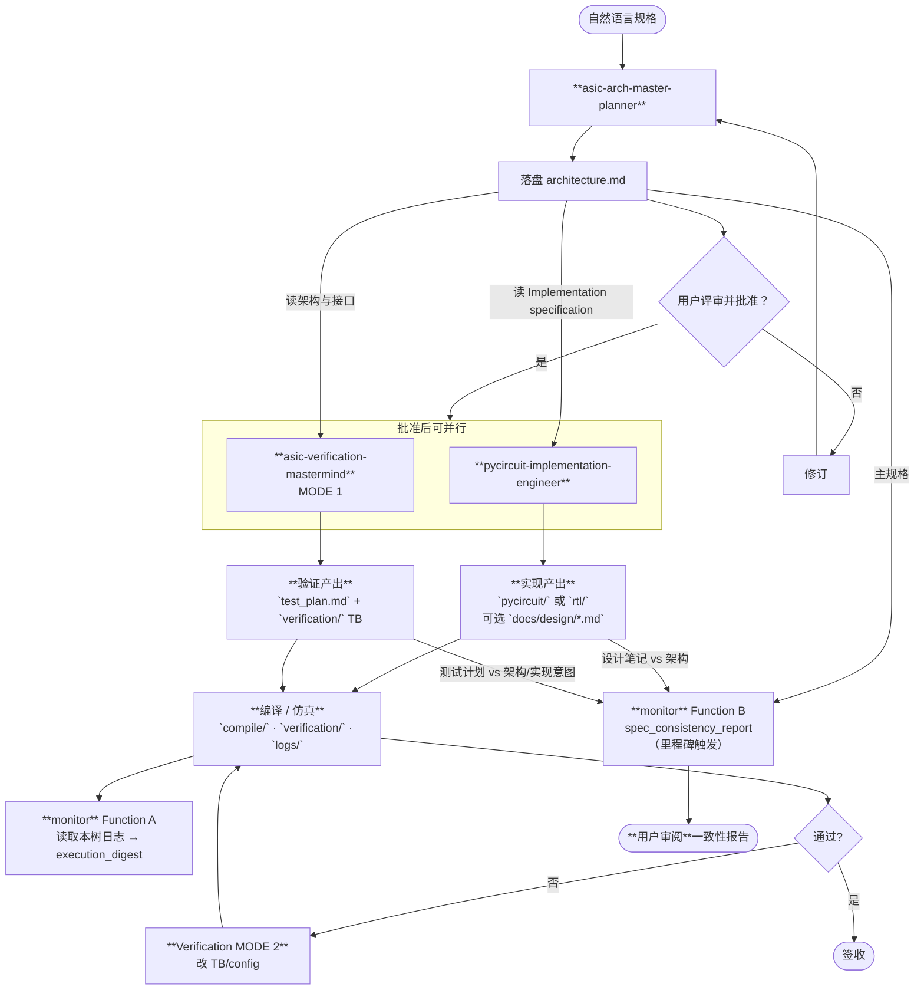
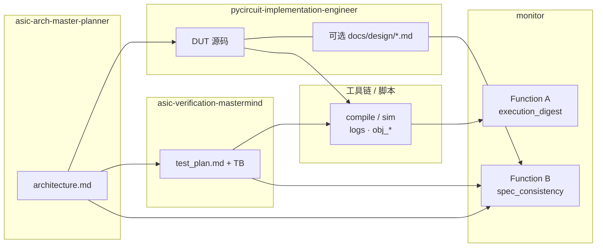

# Sub-Agent 协作流程（可读流程图）

本文总结 **`asic-arch-master-planner`**、**`pycircuit-implementation-engineer`**、**`asic-verification-mastermind`** 与 **`monitor`** 的分工、门禁与顺序，对应 `.cursor/agents/*.md` 与 **ASIC Planner Review Gate**。

## 路径约定（重要）

1. **子代理之间的正式交接文件只有两类 Markdown，分别对应原 JSON：**  
   - **`plan.json` → `docs/plans/<version>/architecture.md`**（叙事 + **Implementation specification** 表格，单文件承载原 JSON 中的模块/端口/参数等）。  
   - **`test_plan.json`（若曾有）→ `docs/test_plans/<slug>/test_plan.md`**（验证 MODE 1 落盘）。  
   **不**写 **`plan.json` / `test_plan.json`**，**不**再新增其它「交接用」文件名（例如单独的 `*handoff*.md`、强制的 `design.md` 交接件等）。

2. **`docs/design/`** 下 **`*.md`**（如 `<module>.md`）仅为实现工程师**可选**的本地设计笔记，**不算** Planner ↔ 实现 ↔ 验证 之间的额外交接契约。

3. **`monitor`** 的产出在 **`docs/monitor/`**（与 **`docs/plans/`** 同级），**不是**与 `architecture.md` / `test_plan.md` 并列的第三种「规格交接」，而是**执行摘要**与**一致性审计报告**。

4. **两种互斥的 Level 2 约定（同一 IP 只选其一）**  
   - **Sub-agent 工作流**：**唯一**目录 **`<pyCircuit_module>__subagent`**。其下 **`docs/`**、DUT 源码、**`compile/`**、**`verification/`**、**`logs/`** 等同树。**禁止**再为同一模块建无后缀的 **`module/`**。  
   - **未走 Sub-agent 的跑批**：可用 **`<module>`**（无 `__subagent`）。

5. **Level 3**：**`docs/`** 与 **`generated_code/`**、**`pycircuit/`** 等**同级**；规划/测试计划 Markdown 在 **`docs/plans/`**、**`docs/test_plans/`**；**`generated_code/`** 仅 MLIR/IR。

详见 **[`.cursor/skills/pycircuit-output-files/SKILL.md`](../../.cursor/skills/pycircuit-output-files/SKILL.md)**、**[`output_files_management.md`](output_files_management.md)**。

---

## 环境变量与根路径

```bash
REPO="$(git rev-parse --show-toplevel 2>/dev/null || pwd)"
OUT_ROOT="${PYC_OUTPUT_ROOT:-$REPO/output_files_YYYY-MM-DD}"
```

---

## 总览流程图

实现（**implementation**）与 **monitor** 的关系：**Function A** 消费由 **DUT + TB** 驱动的 **`compile/` / `verification/` / `logs/`** 中的告警与报错；**Function B** 把 **`architecture.md`** 与实现侧可选 **`docs/design/*.md`**、验证侧 **`test_plan.md`**（及 TB 约定）做交叉比对。



**说明：** **Function B** 可在 **architecture +（可选）design + test_plan** 齐备后运行，不必等待某次仿真通过。**monitor** 默认只写 **`docs/monitor/`**，不修改 DUT。

---

## `module__subagent/` 下 `docs/` 布局（含 monitor）

| 子路径 | 产出方 | 说明 |
|--------|--------|------|
| `docs/plans/<plan_version>/architecture.md` | Planner | **交接**（对应原 `plan.json`） |
| `docs/test_plans/<slug>/test_plan.md` | Verification MODE 1 | **交接**（对应原 `test_plan.json`） |
| `docs/design/<optional>.md` | 实现（可选） | 本地笔记，非交接契约 |
| `docs/monitor/<run_slug>/` | **monitor** | **execution_digest**、**spec_consistency_report** 等 |

---

## 阶段与目录对照

| 阶段 | 落盘 |
|------|------|
| Planner | `docs/plans/…/architecture.md` |
| 实现（可选笔记） | `docs/design/…` |
| MODE 1 | `docs/test_plans/…/test_plan.md` + **`verification/`** 下 TB |
| **monitor A** | `docs/monitor/…/execution_digest*.md` |
| **monitor B** | `docs/monitor/…/spec_consistency_report*.md` |
| DUT | `pycircuit/`、`rtl/` 等 |
| emit/sim | `compile/`、`verification/`、`logs/` |

---

## 泳道视角



**implementation → monitor：** **Function A** 间接依赖实现：没有 **DUT**（及后续 **emit**）就没有 **`compile/`** 侧日志；**TB** 由验证写入但仿真同样依赖 **DUT 与实现路径**。**Function B** 直接读取 **architecture** 与可选 **design 笔记**（实现所写），并与 **test_plan** 对照。

---

## 门禁规则

| 门禁 | 含义 |
|------|------|
| **架构评审** | Planner 交付 **`architecture.md`** 后暂停，待用户批准。 |
| **MODE 1** | 与开始 implementation 同一门槛；批准后可并行。 |
| **MODE 2** | 默认不改 DUT；TB/config 为主。 |
| **monitor 报告** | Function B 产出后须**用户显式审阅**；Monitor 默认不自动改规格文档。 |

---

## 目录示例（Sub-agent）

```text
output_files_YYYY-MM-DD/
└── <module>__subagent/
    ├── docs/
    │   ├── plans/<slug>/architecture.md
    │   ├── design/<module>.md               # 可选
    │   ├── test_plans/<slug>/test_plan.md
    │   └── monitor/<run_slug>/
    │       ├── execution_digest.md          # Function A
    │       └── spec_consistency_report.md   # Function B
    ├── pycircuit/
    ├── rtl/
    ├── compile/
    ├── verification/
    └── logs/
```

---

## 渲染说明

支持 Mermaid 的环境可直接渲染流程图；否则按节点自上而下阅读。
